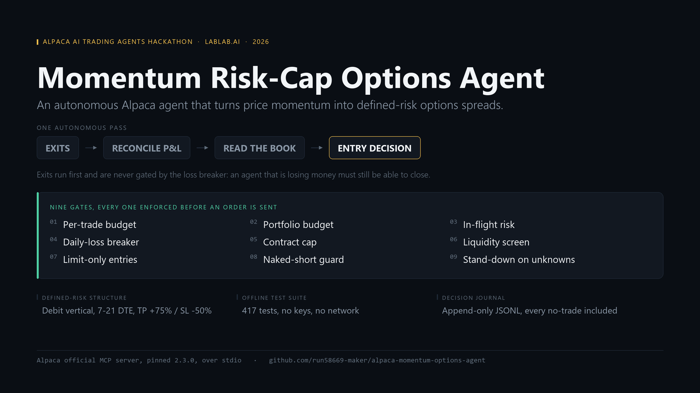

# Alpaca Momentum Options Agent



One-line pitch: an autonomous paper-trading agent that reads recent price momentum
through Alpaca's official MCP server, turns a strong signal into a sized,
defined-risk options trade (a debit vertical spread — long call / short farther call
on strength, the mirror on weakness), and writes a plain-English reason
for every single decision — including every time it decides to do nothing — to an
auditable JSONL journal.

Built for the [Alpaca AI Trading Agents Hackathon](https://lablab.ai/ai-hackathons/alpaca-ai-trading-agents-hackathon)
(lablab.ai, 2026-08-28 → 2026-09-04). Paper trading only. No real-money code path
exists anywhere in this repo.

## Architecture

```
src/agent.py        entry point: argparse, the decision loop, wires everything together
src/mcp_client.py    talks to Alpaca's official MCP server (alpacahq/alpaca-mcp-server, v2)
                      over stdio via the `mcp` Python package; also ships a MockAlpacaMCPClient
                      with deterministic synthetic data for --dry runs (no keys, no network)
src/strategy.py      MomentumRiskCapStrategy: momentum signal -> call/put/hold, with
                      equity-based position sizing and a daily-loss circuit breaker
src/journal.py       append-only JSONL logger; every decision (trade or hold) is logged
                      with its reason; also computes today's realized loss for the
                      circuit breaker
src/pnl.py           FIFO-matches Alpaca FILL activities into closed lots so the
                      circuit breaker has real realized P&L to read, not zero
src/exits.py         ExitPolicy: groups open option positions into the structures they
                      were opened as, then closes them on a time stop / stop loss /
                      take profit -- the only thing in this repo that takes risk off
journal/             decisions.jsonl lands here at runtime (gitignored)
```

Decision loop per pass: `get_clock` -> `get_account_info` -> `get_stock_bars` ->
`get_option_chain` -> `get_account_activities_by_type` (reconcile today's realized
P&L into the journal) -> `get_all_positions` (exit policy: close what should come
off) -> `strategy.decide(...)` -> (if not hold) `place_option_order`, single-leg or
two-leg -> `journal.log(...)`.

Exits run **before** the entry decision and are **not** gated by the circuit breaker:
the breaker exists to stop new risk, and closing a position is the opposite of new
risk. A breaker that also froze exits would trap the losers that tripped it.

## Why options, not just stocks

This hackathon requires strategies to incorporate options trading (see `NOTES.md`).
The momentum signal is computed on the underlying's price bars (simple and
explainable), but the resulting trade is always an options trade.

The structure is a **debit vertical spread**, not a naked long: having picked the
near-ATM long leg, the strategy sells a farther-OTM leg of the same expiry, targeting
a width of `--spread-width-pct` (default 3%) of spot. Two consequences the journal
records for every trade:

- **Max loss is known before the order is sent** — it is the net debit x 100 x
  contracts, and it is the number position sizing budgets against, not the premium.
- **The order leaves as one multi-leg limit order at that debit**, so the fill can
  never cost more than the risk the strategy signed off on.

If the chain has no cheaper, farther-OTM leg at that expiry, the agent falls back to
the naked long and says so in the reason (`--spread-width-pct 0` forces that path).

## Setup

```
pip install -r requirements.txt
```

Real run needs `uv`/`uvx` on PATH (it spawns the pinned `alpaca-mcp-server==2.3.0`) and
free Alpaca paper API keys from https://alpaca.markets. Before the first live session,
prove the transport without an account:

```
py scripts/preflight_live.py
```

It handshakes with the real server using placeholder credentials and checks every tool
name and argument name this project sends against the server's advertised schema.
Then:

```
set ALPACA_API_KEY=...
set ALPACA_SECRET_KEY=...
py src/agent.py --symbol SPY --iterations 1
```

## Dry run (no keys needed)

```
py src/agent.py --dry --symbol SPY --iterations 3
```

Uses `MockAlpacaMCPClient`: synthetic price bars with a small upward drift, a
synthetic two-strike option chain, and in-memory fake order fills. Exercises the
full loop end to end — strategy math, sizing, journaling — with zero external
dependencies. See `RUN_LOG.md` for a captured run.

## Tests

```
py -m unittest discover -s tests -v
```

390 tests, stdlib only — no API keys, no network, no `pip install`. Covers the
momentum math, position sizing and its caps, every `decide()` branch (including
the circuit breaker taking precedence over a strong signal), the account-level
portfolio risk budget (a book at the cap holds, partial headroom shrinks the size,
a structure whose worst case is not computable stands the entry down, and an order
that is working but unfilled is charged to the budget before it fills, and a working-order
book too large for one page is paged through rather than truncated or crashed on),
contract selection
(DTE window edges, near-ATM ranking, deterministic tie-breaks, unparseable chain
rows), the bid-ask liquidity screen (both legs, unquoted and crossed rows, the
cap boundary), the exit rules and structure grouping, the closing- and
opening-order idempotency keys (including a refused entry booking no risk), FIFO realized-P&L matching, the journal's same-day negative-P&L
accounting, and the `--dry` loop end to end against the mock client with a temp
journal.

## Contract selection

The chain row to trade is chosen explicitly, never "whatever came first in the
chain": contracts are filtered to the wanted type and to expiries `min_dte`–
`max_dte` days out (default 7–21), then ranked by strike distance from spot
(near-ATM), tie-broken by the expiry nearest the middle of the window and then by
contract symbol, so the pick is deterministic regardless of chain ordering.
Nothing in the window means HOLD, with a reason listing the expiries the chain did
offer. The chosen contract travels inside the `Decision`, so the order that gets
placed is always the contract the logged reason names.

A liquidity screen sits between the expiry window and the strike ranking: any
contract quoting a bid-ask spread wider than `--max-spread-pct` of its own midpoint
(default 10%) is dropped before ranking, so a stale market can never win on being
nearest the money. The short leg of the spread is screened the same way, before the
width ranking -- the far-OTM strikes the width target favours are exactly where
quotes go wide, and a short leg is a position that has to be bought back. Contracts
the chain carries no two-sided quote for are traded but flagged `unscreened` in the
reason, because refusing them would mean never trading on a feed without quotes.
Every decision reason states the chosen contract's own market and how many
candidates the screen rejected. `--max-spread-pct 0` turns it off; to see the same
chain picked both ways side by side:
`py scratch/repro_liquidity_screen_20260825_1345.py`.

## Risk controls

- `--risk-pct` (default 1%) caps how much equity a single trade risks.
- `--max-contracts` (default 5) is a hard ceiling regardless of sizing math.
- `--max-daily-loss-pct` (default 3%) is a circuit breaker: once today's realized
  loss reaches this fraction of equity, the agent forces `hold` on every subsequent
  pass for the rest of the day. That loss is reconciled from the account's own FILL
  activities before each decision (FIFO lot matching, one journal record per close,
  de-duplicated by activity id) — see NOTES.md. To watch it fire without keys:
  `py src/agent.py --dry --max-daily-loss-pct 0.001`, where the mock account's
  canned $450 realized loss is enough to halt trading.
- Exits (`src/exits.py`) close what is already open, on three rules checked in this
  order: `--close-before-dte` (default 1) closes anything that near expiry win or
  lose, rather than carrying expiry/assignment risk; `--stop-loss-pct` (default 50%)
  and `--take-profit-pct` (default 75%) act on the structure's unrealized P&L as a
  fraction of what it cost. Legs are grouped into structures by (underlying, expiry,
  type) and a vertical is closed as one `mleg` order -- closing one leg of a spread
  would turn defined risk into a naked short. A structure with 0 `qty_available` is
  skipped, not closed twice: that field is how Alpaca says a close is already
  working. To watch all three rules fire without keys, against a mock book built for
  it: `py src/agent.py --dry` (`--no-exits` turns exit management off).
- Every closing order carries a `client_order_id` idempotency key, printed next to the
  decision in `--dry` and journalled with the order. `place_option_order` can time out
  *after* the request reached Alpaca, so the agent cannot tell "never sent" from "sent,
  reply lost"; a blind retry would flatten the position twice and the second fill would
  open a fresh one the wrong way round. The key is derived from the day, the contract
  count and the legs, so a retry of the identical close is refused by Alpaca while a
  partial-fill remainder (smaller qty) and tomorrow's retry (new day) still go through.
  A refused close is journalled as `order_rejected` rather than counted as a close. To
  watch the refusal end to end: `py scratch/repro_duplicate_close_20260825_1120.py`.
- `ALPACA_PAPER_TRADE` is hardcoded to `"true"` in `AlpacaMCPClient` — there is no
  flag or env var in this codebase that can flip it to live trading.

## CLI flags

Run `py src/agent.py --help` for the full list (`--symbol`, `--iterations`,
`--lookback`, `--momentum-threshold`, `--risk-pct`, `--max-contracts`,
`--max-daily-loss-pct`, `--spread-width-pct`, `--max-spread-pct`,
`--pnl-lookback-days`,
`--take-profit-pct`, `--stop-loss-pct`, `--close-before-dte`, `--no-exits`,
`--journal-path`, `--dry`).
